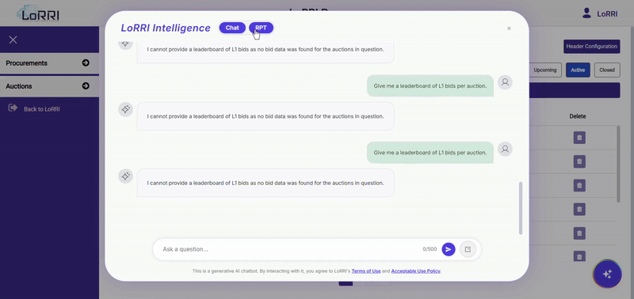
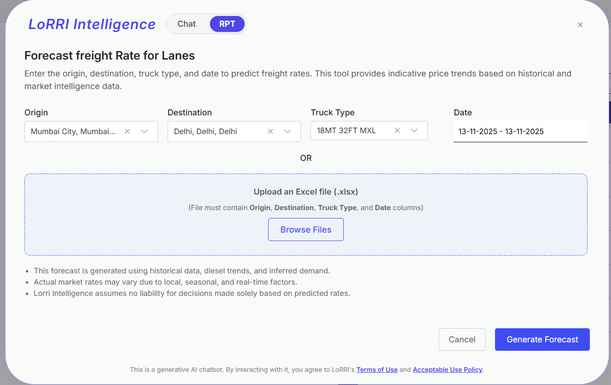
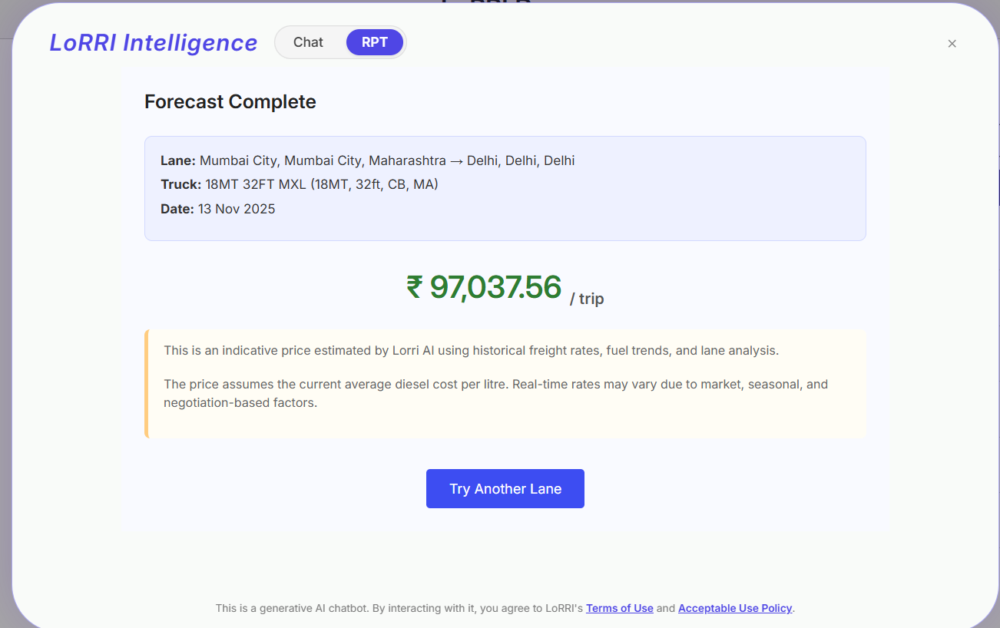
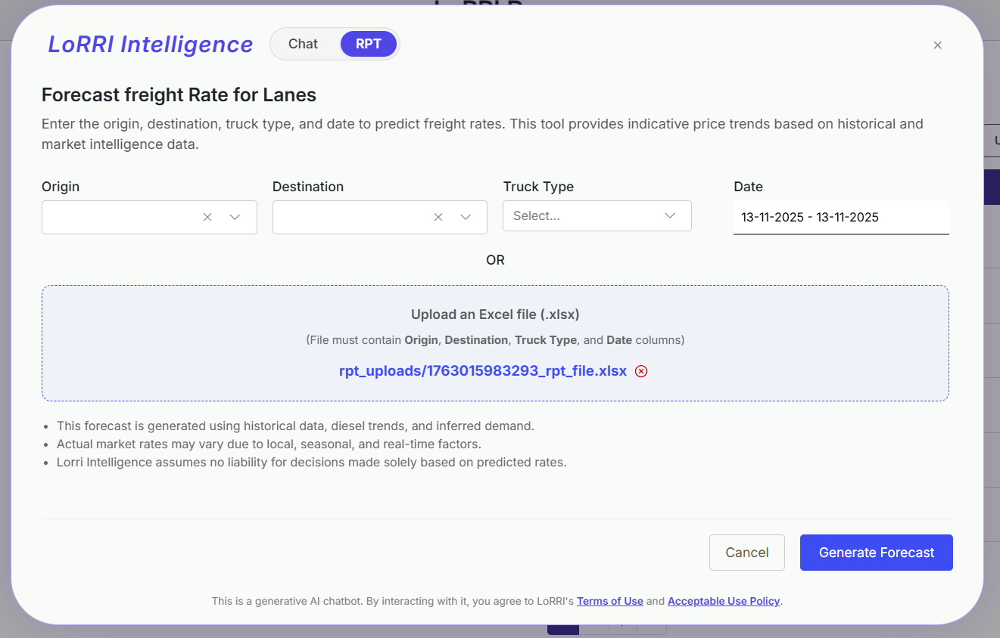
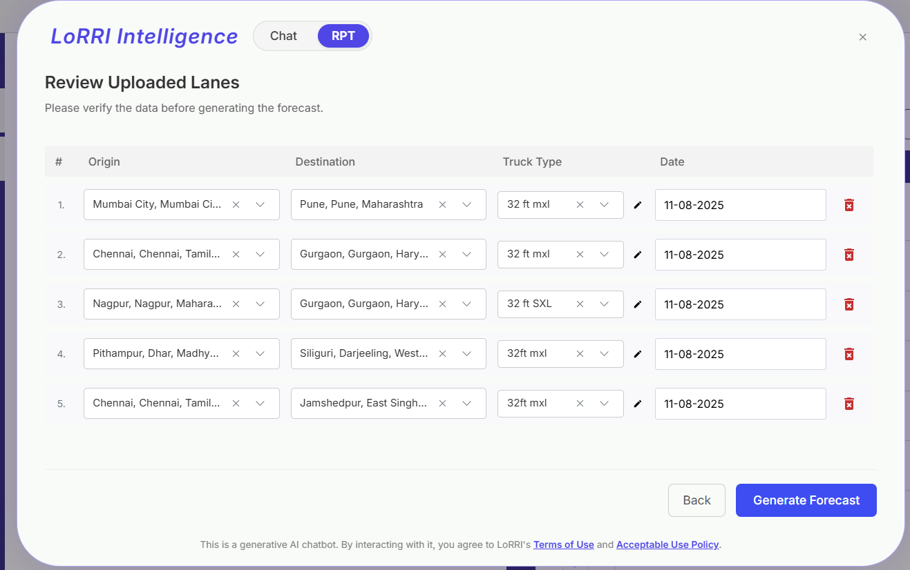
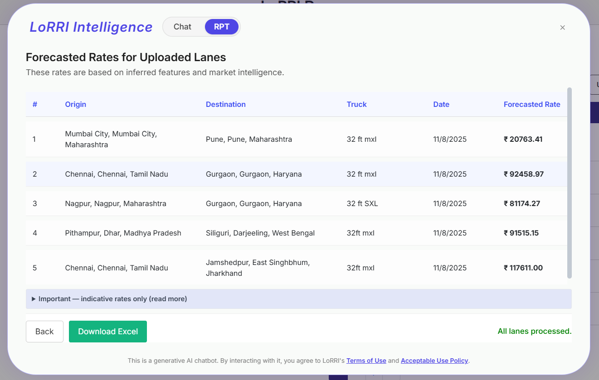

# RPT – Freight Rate Prediction Tool

This project predicts freight base prices for specific origin–destination–truck-type (ODT) lanes using structured machine learning models trained on historical logistics data. It is modular, versioned, and built for reproducibility.

## Project Structure

```

.
├── data/                   # Raw, processed, and intermediate datasets
├── models/                # Saved LightGBM models, configs, metrics
├── notebooks/             # Jupyter notebooks for exploration
├── scripts/               # CLI utilities (optional)
├── src/                   # All source code
│   ├── config/            # Configs (e.g., config.yaml)
│   ├── data/              # Data cleaning and preprocessing
│   ├── models/            # Training scripts
│   ├── model\_evaluation/  # Model comparison logic
│   └── utils/             # Reusable utility functions
├── tests/                 # Test cases (if applicable)
├── environment.yml        # Conda environment definition
├── Makefile               # Setup, verify, and management commands
└── README.md              # You’re reading it

````

---

## Environment Setup

This project uses **conda** for environment management and **Makefile** to simplify common tasks.

### Step 1: Create the environment
```bash
make setup

pip freeze | grep -vE '@ file://' > requirements.txt
````

* Creates `rpt-env` using `environment.yml`
* Installs additional pip packages from `requirements.txt`

### Step 2: Activate the environment

```bash
conda activate rpt-env
```

---

## Verify Setup

Run:

```bash
make verify
```

This checks:

* Python version (should be ≥ 3.10)
* Core dependencies: `lightgbm`, `pandas`, `numpy`, `scikit-learn`, `yaml`, `joblib`

---

## Other Make Commands

| Command          | Description                                   |
| ---------------- | --------------------------------------------- |
| `make clean_env` | Delete the `rpt-env` conda environment        |
| `make info`      | Show environment and binary paths             |
| `make which`     | Show exact Python and pip paths               |
| `make freeze`    | Freeze pip dependencies to `requirements.txt` |

---


## Models

Each model folder contains:

* `model.pkl` – Serialized model
* `model.txt` – Native LightGBM dump
* `model_config.json` – Training config
* `model_metrics.json` – Evaluation results
* `category_map.pkl` – Encoded category mappings

---
## Project Screenshots

### Demo


---

### Interface Screenshots



---
### File Upload Screens





## Python Version

This project requires **Python ≥ 3.10**

---

## License

Internal use only. All rights reserved by LogisticsNow.

---